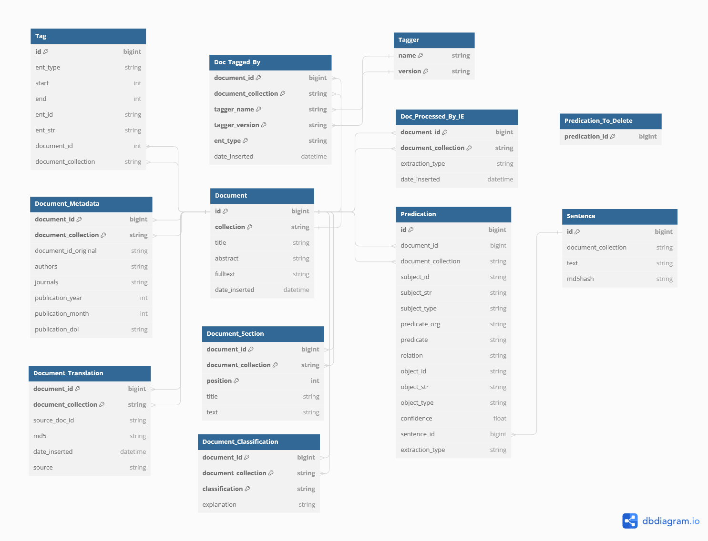

# Narrative Annotation
This repository brings all the pharmaceutical specific entity linking, text classification and statement extraction logic. 

Therefore it builds upon a subproject:
- [KGExtractionToolbox](https://github.com/HermannKroll/KGExtractionToolbox): Basic entity linking methods / information extraction / pipelines for automatisation


We will use the NarrativeAnnotation and NarrativeIntelligence package together for mining purposes.
So first, check out NarrativeIntelligence. 
```
cd ~
git clone --recurse-submodules https://github.com/HermannKroll/NarrativeIntelligence.git
```

Next, we create symbolic links to link NarrativeAnnotation to our home directory (and link the toolbox to NarrativeAnnotation).
```
ln -s ~/NarrativeIntelligence/lib/KGExtractionToolbox ~/NarrativeIntelligence/lib/NarrativeAnnotation/lib/KGExtractionToolbox
ln -s ~/NarrativeIntelligence/lib/NarrativeAnnotation ~/NarrativeAnnotation
```

# Update Mining Pipeline

If you use it as a subrepo of NarrativeIntelligence (as introduced above):
```
cd ~/NarrativeIntelligence/
git pull --recurse-submodules
```


# Setup

### Hardware Requirements
We recommend having at least 16GB of RAM available and 100GB of disk space. 
Our annotation and extraction methods will work in a temporary directory in /tmp/ (so please make sure to have at least 100GB available).

# Database Setup
The project was tested on SQLlite and PostgresDB databases. 
For larger databases, we recommend to use PostgresDB. 
Setup a PostgresDB environment (see [official instructions](https://www.postgresql.org)).
This project stores its processed data in a relational database that stores the processed documents. 
So first please setup a Postgres database by following the official instructions. 
We used V14. 

## Schema

## General Database Schema


## Configure Postgres

```
sudo nano /etc/postgresql/14/main/postgresql.conf
```

Change the following settings. 
More memory is better.
```
shared_buffers = 20GB	
work_mem = 5GB			

max_wal_size = 1GB
min_wal_size = 500MB
```

Restart Postgres Server.
```
sudo systemctl restart postgresql
```

## Configure fidpharmazie database

Create a new postgres database. 
Log in first.
```
psql -h localhost -U postgres -W
```

Create the database.
```
CREATE DATABASE fidpharmazie;
```


Edit the following file
```
nano /etc/postgresql/14/main/pg_hba.conf
```
by adding the line
``` 
host    fidpharmazie    all             127.0.0.1/32            md5
```
This line allows accessing the database from localhost. 

If you already have a database dump, load it now.
Restore the database dump via:
``` 
pg_restore -h 127.0.0.1 -O -U postgres -W -d fidpharmazie fidpharmazie_2023_06_12.dump
``` 

After the database has been restored, we need to create an user for the database. 
Login into the database as the postgres user.
```
psql -h localhost -U postgres -W -d fidpharmazie
```
Create user for the service.
Please replace EXAMPLE_PW by a real password.
```
CREATE USER mininguser WITH PASSWORD 'EXAMPLE_PW';
```

Setup user permissions:
```
GRANT ALL PRIVILEGES ON SCHEMA public TO mininguser;
GRANT ALL PRIVILEGES ON ALL TABLES IN SCHEMA public TO mininguser;
GRANT USAGE, SELECT ON ALL SEQUENCES IN SCHEMA public TO mininguser;
```


## Database configuration
Configure the database configuration in the project:
```
cd ~/NarrativeAnnotation/config/
cp backend.prod.json backend.json
nano backend.json
```
Please enter your database credentials in this file. We support Postgres and SQlite databases. 
If you would like to work with SQLite then enable the *use_SQLite* property and set a corresponding path.
```
{
  "use_SQLite": false,
  "SQLite_path": "sqlitebase.db",
  "POSTGRES_DB": "fidpharmazie",
  "POSTGRES_HOST": "127.0.0.1",
  "POSTGRES_PORT": "5432",
  "POSTGRES_USER": "mininguser",
  "POSTGRES_PW": "EXAMPLE_PW",
  "POSTGRES_SCHEMA": "public"
}
```

# Python Setup
First, make sure that a gcc is installed in your system.
```
sudo apt-get install gcc python3-dev
```


## Create a virtual environment

### Install Anaconda
Make sure that conda (with Python 3 support) is installed.
If not, install it via:

```
curl https://repo.anaconda.com/archive/Anaconda3-2021.11-Linux-x86_64.sh --output anaconda.sh
bash anaconda.sh
```

It is a good idea to perform conda init, so that conda commands are available in your shell. 
By default, anaconda will be installed to
```
/home/pubpharm/anaconda3
```

If you did not run conda init, then run:
```
eval "$(/home/pubpharm/anaconda3/bin/conda shell.bash hook)"
conda init
```
Otherwise, just log out of shell and log in again. 
Init will happen automatically.

Install python = 3.8.
Decider whether you want to work with a global python version or with a conda environment (see [tutorial](https://towardsdatascience.com/getting-started-with-python-environments-using-conda-32e9f2779307))
E.g., a virtual environment on your machine via Conda.
```
conda create -n narrant python=3.8
```

Activate the environment
```
conda activate narrant
```

## Dependencies
Install all Python requirements:
```
pip install -r ~/NarrativeAnnotation/requirements.txt
pip install -r ~/NarrativeAnnotation/lib/KGExtractionToolbox/requirements.txt
```

## Setup Python Path
You need to setup the python path. 
This procedure must be repeated every time you create a new shell. 
You can add the path to your bash defaults.
To run scripts from this project, please set the Python path as follows:
```
export PYTHONPATH="/home/pubpharm/NarrativeAnnotation/src/:/home/pubpharm/NarrativeAnnotation/lib/KGExtractionToolbox/src/"
```


# Configuration (Additional Dependencies)
First go into the NarrativeAnnotation directory. 
```
cd NarrativeAnnotation/
```


For the following configuration, wget and zip need to be installed.
```
apt install wget zip
```

## Setup NLTK
Please run the following script to configure NLTK:
```
python ~/NarrativeAnnotation/lib/KGExtractionToolbox/src/kgextractiontoolbox/setup_nltk.py
```

## Download required data
Then,additional data (e.g., MeSH and Gene vocabularies) must be downloaded.
Switch to the NarrativeAnnotation directory and execute the bash script:
```
cd NarrativeAnnotation/
bash download_data.sh
```


## Entity Linking Configuration
First create a directory for external annotation tools.
```
mkdir ~/tools
```

We use GNormPlus as an external annotation tool. 
Download [GNormPlus](https://www.ncbi.nlm.nih.gov/research/bionlp/Tools/gnormplus/), unzip it and put it into the tools directory.

Download GNormPlus via command line:
```
cd ~/tools
wget https://www.ncbi.nlm.nih.gov/CBBresearch/Lu/Demo/tmTools/download/GNormPlus/GNormPlusJava.zip
```

Then unzip the software:
```
unzip GnormPlusJava.zip
```

Structure should now look like:
```
tools/
  GNormPlusJava/
```

First make sure, that Java is installed on your system.
```
java --version
```

If java is not installed, then install it via:
```
sudo apt install default-jre
```

Then GNormPlus needs to be installed. 
Follow the readme.txt instructions inside the GNormPlus folder.
Then set permissions +x for all files:
```
chmod +x -R ~/tools/GNormPlus/
```
If you follow the instruction and your last step was "su", make sure that you activate the Python environment and set the Python path again.

Configure the entity linking configuration for the project.
```
cd ~/NarrativeAnnotation/config/
cp entity_linking.prod.json entity_linking.json
nano entity_linking.json
```
Enter your GNormPlus root path. TaggerOne does not need to be set.
```
{
  ...
  "gnormPlus": {
    "root": "/home/pubpharm/tools/tagger/GNormPlusJava",
    "javaArgs": "-Xmx16G -Xms10G",
    "timeout": 10
  },
  ...
}
```

We also support [TaggerOne](https://www.ncbi.nlm.nih.gov/research/bionlp/tools/taggerone/) but **do not** use it at the moment.
You can also download the tool and put it into the tools repository. 
However, TaggerOne requires to build some models.
To use TaggerOne, see its readme file. 
Some models must be build manually.
As you do not indent to use it at the moment, you can ignore this step.

Otherwise, download the tool and put it here.
```
tools/
  GNormPlusJava/
  TaggerOne-0.2.1/
```
Then edit the previous configuration and setup the TaggerOne Path.


## Extraction Configuration
This project will utilize PathIE to do the extraction.
Therefore, you need to install 
- [Stanford CoreNLP](https://stanfordnlp.github.io/CoreNLP/)

First make sure, that Java is installed on your system.
```
java --version
```

If java is not installed, then install it via:
```
sudo apt install default-jre
```

First switch to the tools directory:
```
cd ~/tools
```

Download the tool and extract the tool.
```
wget https://nlp.stanford.edu/software/stanford-corenlp-4.5.5.zip
```
Unzip it.
```
unzip stanford-corenlp-4.5.5.zip
```
Note, you can store the tool anywhere you want. 

Next, edit the nlp.conf in this directory.
```
cd ~/NarrativeAnnotation/config
cp nlp.prod.json nlp.json
nano nlp.json
```

Then edit the following **corenlp** path. We just need the corenlp path.
```
{
  "corenlp": ".../stanford-corenlp-4.1.0/", # required for PathIE and CoreNLP OpenIE
  ...
}
```
If you want to use the other tools, see the following [Readme](https://github.com/HermannKroll/KGExtractionToolbox/blob/main/README_03_EXTRACTION.md) for details.

Next, add the +x flag to our bash script to invoke PathIE. 
```
chmod +x ~/NarrativeAnnotation/lib/KGExtractionToolbox/src/kgextractiontoolbox/extraction/pathie/run.sh
```

# Build Tagging Indexes
Build all tagging indexes:
```
python ~/NarrativeAnnotation/src/narrant/build_all_indexes.py
python ~/NarrativeAnnotation/src/narrant/build_all_tagging_indexes.py
```

# Export highest predication id
The pipeline is capable of only processing delta entries. 
Therefore, we need to know what the last highest predication id was.
Run:
```
bash ~/NarrativeAnnotation/scripts/export_highest_predication_id.sh
```

# General Remarks
This repository contains methods to annotate entities in document text. We build the pipeline upon a relational database structure, i.e., 
all relevant information will be stored in the database. For example, annotating documents will first insert the documents into the database and then insert the 
produced annotations as well. After the annotation is completed, the annotation can be exported.

We distinguish documents by their id and their collection. We assume documents to have an unique integer id within a document collection. 
For example, the document id *123* is must refer to a unique id within the collection *Test*.


Some general remarks:
- document ids must be integer and must be unique within a document collection
- a document collection can be an arbitrary string
- documents won't be tagged twice. Our pipeline checks whether the documents were tagged for the given entity types before. Only new documents will be tagged.  
- documents must be in PubTator, JSON or JSON Line (JSONL) format
- documents that do not meet the above constraint may be transformed first. See the src/narrant/pubtator/translation for good examples
- there is an additional table (DocumentTranslation) in which such a translation could be stored
- Documents won't be inserted twice. There is a global setting that duplicated tuples are ignored when inserted in the database.


# Vocabulary Documentation
This project supports the annotation of documents by utilizing different biomedical vocabularies. 
The project will build vocabularies automatically when being used.
However, additional vocabulary documentation can be found [here](README_Vocabularies).


## Supported JSON and JSONL Document Format
Here is an example of our JSON format:
```
[
  {
      "id": 92116,    
      "title": "In situ microspectrofluorometry of nuclear and kinetoplast DNA in Trypanosoma gambiense.",                                                                                                                                            
      "abstract": "Using a spectrofluorometer with the Zeiss Universal Micro-Spectrophotometer 1 (UMSP 1), [...]",   
  },
  // more documents ...
]
```
The outmost array brackets `[]` can be omitted if only a single json document should be contained within the file.


We also support the .jsonl format, where each document JSON is stored in a single line. 
Files must have the suffix: .jsonl
Here is an example of the JSONL format:
```
{"id": "1", "title": "Comparing Letrozole", "abstract": "Abstract 1"}
{"id": "2", "title": "A Study Investigating", "abstract": "Abstract 2"}
{"id": "3", "title": "Title 3", "abstract": "Abstract 3"}
```


Note:
- a document id must be an integer
- id, title and abstracts field are required
- title or abstract field may be empty


## Loading Documents
You can load your documents:
```
python src/narrant/backend/load_document.py DOCUMENTS.json --collection COLLECTION
```
Document ids must be unique integers within a document collection. 
The loading procedure will automatically include entity annotations (tags) if contained in the document file. 
If you don't want to include tags, use the **--ignore_tags** argument.

```
python src/narrant/backend/load_document.py DOCUMENTS.json --collection COLLECTION --ignore_tags
```

# Document Translation
See the following [Readme](README_01_TRANSLATION.md) for details.

# Entity Linking
See the following [Readme](README_02_ENTITY_LINKING.md) for details.

# Document Classification:
See the following [Readme](README_03_CLASSIFICATION.md) for details.

# Pharmaceutical Extraction Pipeline
See the following [Readme](README_04_EXTRACTION.md) for details.

# Example Pipelines (used for the [Narrative Service](https://github.com/HermannKroll/NarrativeIntelligence))
See the following [Readme](README_05_PIPELINES.md) for details.

# Export
See the following [Readme](README_06_EXPORT.md) for details.

# Cleaning a Document Collection 
You can delete all information that are stored for a document collection by running:
```
python src/narrant/backend/delete_collection.py COLLECTION
```
This will clean the database. 
The script will ask you for your agreement to delete the collection. 
We support a **--force** argument to directly delete the collection.
```
python src/narrant/backend/delete_collection.py COLLECTION --force
```