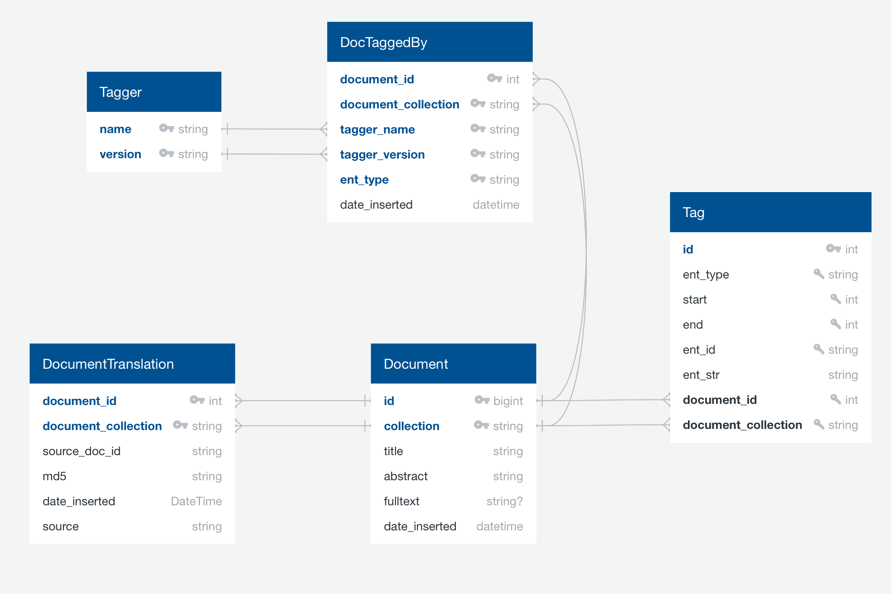

# General 
This repository contains methods to annotate entities in document text. We build the pipeline upon a relational database structure, i.e., 
all relevant information will be stored in the database. For example, annotating documents will first insert the documents into the database and then insert the 
produced annotations as well. After the annotation is completed, the annotation can be exported.

We distinguish documents by their id and their collection. We assume documents to have an unique integer id within a document collection. 
For example, the document id *123* is must refer to a unique id within the collection *Test*.


Some general remarks:
- document ids must be integer and must be unique within a document collection
- a document collection can be an arbitrary string
- documents won't be tagged twice. Our pipeline checks whether the documents were tagged for the given entity types before. Only new documents will be tagged.  
- documents must be in the PubTator format
- documents that do not meet the above constraint may be transformed first. See the src/narrant/pubtator/translation for good examples
- there is an additional table (DocumentTranslation) in which such a translation could be stored
- Documents won't be inserted twice. There is a global setting that duplicated tuples are ignored when inserted in the database.


## Database Schema


created with app.quickdatabasediagrams.com


# Preprocessing
### Hardware Configuration
We recommend having at least 32GB of RAM available. 
### Checkout or download the GitHub project

Then,additional data must be downloaded.
Switch to the NarrativeAnnotation directory and execute the bash script:
```
cd NarrativeAnnotation/
./download_data.sh
```

We have switched to the ChemBL Database. 
No additional files are required!


### Database Setup
1. Setup a PostgresDB environment (see [official instructions](https://www.postgresql.org)). Tagging results, documents and more will be stored in this relational database. 
2. Create a new database and user for the preprocessing pipeline, e.g. *taggingdb* and *tagginguser*

### Database configuration
Setup the database configuration in the project
```
cd NarrativeAnnotation/config/
cp backend.prod.json backend.json
nano backend.json
```
Enter your database credentials, e.g.:
```
{
  "POSTGRES_DB": "example",
  "POSTGRES_HOST": "127.0.0.1",
  "POSTGRES_PORT": "5432",
  "POSTGRES_USER": "user",
  "POSTGRES_PW": "pw",
  "POSTGRES_SCHEMA": "public"
}
```

### Install Python
Install python >= 3.7. Decider whether you want to work with a global python version or with a conda environment (see [tutorial](https://towardsdatascience.com/getting-started-with-python-environments-using-conda-32e9f2779307))
### Dependencies
Install all packages from requirements.txt
```
pip3 install -r requirements.txt
```

### Python Path
You need to setup the python path. This procedure must be repeated every time you create a new shell. You can add the path to your bash defaults.
```
export PYTHONPATH=/home/kroll/NarrativeAnnotation/
```


## Supported Document Format (PubTator)
We assume each document to have a document id, a document collection, a title and an abstract. Document ids must be unique with a document collection. Our pipeline expects documents to be in the [PubTator format](https://www.ncbi.nlm.nih.gov/CBBresearch/Lu/Demo/PubTator/tutorial/index.html). 
```
document_id|t|title text here
document_id|a|abstract text here

```
ATTENTION: the PubTator file must end with two *\n* characters. 
The document id must be an integer. Title and abstract can include special characters - the texts will be sanitized in our pipeline. 
If you want to tag several documents, you can choose from two options:
1. Create a PubTator file for each document and put them into a directory
2. Create a single PubTator file with several documents
```
document_id_1|t|title text here
document_id_1|a|abstract text here

document_id_2|t|title text here
document_id_2|a|abstract text here

document_id_3|t|title text here
document_id_3|a|abstract text here

```
The files are separated by two new line characters *\\n*. ATTENTION: the PubTator file must end with two *\\n* characters. 

### Document JSON Format
Here is an example of our JSON format:
```
[
  {
      "id": 12345,
      "title": "Barack Obama [...]",
      "abstract": "Obama was born in Honolulu, Hawaii. After graduating from Columbia University in 1983 [..]",
  },
  // more documents ...
]
```
The outmost array brackets `[]` can be omitted if only a single json document should be contained within the file.

Note:
- a document id must be an integer
- id, title and abstracts field are required
- the abstract field may be empty

## Loading Documents
You can load your documents:
```
python src/kgextractiontoolbox/documents/load_document.py DOCUMENTS.json --collection COLLECTION
```
Document ids must be unique integers within a document collection. 
The loading procedure will automatically include entity annotations (tags) if contained in the document file. 
If you don't want to include tags, use the **--ignore_tags** argument.

```
python src/kgextractiontoolbox/documents/load_document.py DOCUMENTS.json --collection COLLECTION --ignore_tags
```


# Running the Annotators
In this section, we briefly describe how to use our pipeline.
For the examples below, we suppose you to be in the correct directory. So,
```
cd ~/NarrativeAnnotation/
```

First, create a copy of the preprocessing configuration.
```
cp config/preprocessing.prod.json config/preprocessing.json
```

The idea of our pipeline is based on entity types. For example, if a user want to annotate drugs in text, then the corresponding annotation tool will be invoked. 
Hence, the user could specifiy which entity types she wants to annotate in texts.

## Annotation Data (Tags)
The tagging pipeline produces tags. A tag represents an annotation and consists of a:
- document id (int)
- document collection (string)
- start position in text (int)
- end position in text (int)
- entity str (the annotated text sequence, string)  
- entity id (string)
- entity type (string)


## Dictionary-based Taggers (Own Vocabularies)
The documents must be in the database for annotation purposes. If you call an annotation script, the documents will automatically be inserted. 
You can invoke our own dictionary-based tagger pipeline via
```
python3 src/narrant/preprocessing/dictpreprocess.py -i test.pubtator --collection test
```
This call will invoke the pipeline to annoate all known entity types.
The pipeline annotates Diseases, Dosage Forms, Drugs, Chemicals, Excipients, Methods, LebMethods and Plant Families.
The first run will build all necessary indexes that will speed up further runs. So, the first run may take a bit.


You can may also speedup the tagging process. You invoke multiple parallel workers. 
The number of parallel workers can be specified as follows:
```
python3 src/narrant/preprocessing/dictpreprocess.py -i test.pubtator --collection test --workers 10
```

If you are certain that all documents are already in the database, you may skip the loading phase by:
```
python3 src/narrant/preprocessing/dictpreprocess.py -i test.pubtator --collection test --skip-load
```


The pipeline will work in a temporary directory (random directory in /tmp/) and remove it if the task is completed. If you want to work in a specified directory, use
```
python3 src/narrant/preprocessing/dictpreprocess.py -i test.pubtator --collection test --workdir temp/
```
The temporary created files as well as all logs won't be removed then. 


## TaggerOne and GNormPlus (ThirdParty)
In addition to our own annotation tools, we build support for two frequently used biomedical tools. 
TaggerOne supports the annotation of Chemicals and Diseases.
GNormPlus supports the annotation of Genes and Species.

A setup guide is available here: [Setup Guide](README_BIOMEDICAL_TOOS.md).


### Run the ThirdParty Annotators
You may annotate documents with TaggerOne. Assume we have a test document test.pubtator.
```
python3 src/narrant/preprocessing/preprocess.py test.pubtator --collection test --tagger-one 
```
In addition, you may annotate documents with GNormPlus. 
```
python3 src/narrant/preprocessing/preprocess.py test.pubtator --collection test --gnormplus
```

The pipeline will invoke the taggers to tag the documents. The document corpus is *test*.
The tools can be invoked by:
- tagger-one means that TaggerOne will be used to annotate Chemicals and Diseases.
- gnormplus means that GNormPlus will be used to annotate Genes and Species.

Note: only one tagger can be selected in a tagging process.

The pipeline will work in a temporary directory and remove it if the task is completed. If you want to work in a specified directory, use
```
python3 src/narrant/preprocessing/preprocess.py test.pubtator --collection test --workdir temp/ --gnormplus 
```
The temporary created files as well as all logs won't be removed then.

# Indexes
If you want to export in our specified XML format, you need to create some indexes before you can use the XML export.
There are two index modes:
- a complete index (takes more space, but only computed once)
- a partial index (only includes tagged entity ids in our db, smaller but must be recreated if new entites are tagged)


Partial index: Run the following script to create a **partial index**.
The script will ask you if your database connection is configured properly. 
```
python3 src/narrant/build_all_indexes.py
```
...and enter yes if the correct database connection is selected.
This might take a while and will build all required indexes. 
Attention: indexes for genes and species will only be build for those tag ids that have been annotated so far. 
If you annotate more documents, you **must** rebuild the indexes. 


Complete index: You can prevent rebuilding the index creation by creating a complete entity index. 
Therefore, run:
```
python3 src/narrant/build_all_indexes.py --complete
```

# Export
Read the Indexes section before.
### Export XML UB
Finally, you can export the documents:
```
python3 src/narrant/backend/exports/xml_export.py output_dir -c COLLECTION_NAME
```
See help for parameter description. The output format looks like: document_id.xml and the content:


```
<?xml version="1.0" ?>
<document>
   <tag source="NCBI Gene">eukaryotic translation initiation factor 2 alpha kinase 2</tag>
   <tag source="NCBI Gene">Atf4</tag>
   <tag source="NCBI Gene">DNA damage inducible transcript 3</tag>
   <tag source="NCBI Gene">DDIT3</tag>
   <tag source="NCBI Gene">eukaryotic translation initiation factor 2 alpha kinase 3</tag>
   <tag source="NCBI Gene">EIF2AK3</tag>
   <tag source="DrugBank">Toyocamycin</tag>
   <tag source="NCBI Taxonomy">house mouse</tag>
   <tag source="NCBI Taxonomy">Mus musculus</tag>
   <tag source="MeSH">Wounds and Injuries</tag>
   <tag source="MeSH">Death</tag>
</document>
```

# Translation 
In this section, we describe how to convert different formats into a PubTator format.
## Patents
Suppose you have the Patents available text file (see the following example).
```
oai:tib.eu:epa:EP3423078|T-CELL MODULATORY MULTIMERIC POLYPEPTIDES AND METHODS OF USE THEREOF
oai:tib.eu:epa:EP3423078|The present disclosure provides variant immunomodulatory polypeptides, and fusion polypeptides comprising the variant immunomodulatory peptides. The present disclosure provides T-cell modulatory multimeric polypeptides, and compositions comprising same, where the T-cell modulatory multimeric polypeptides comprise a variant immunomodulatory polypeptide of the present disclosure. The present disclosure provides nucleic acids comprising nucleotide sequences encoding the T-cell modulatory multimeric polypeptides, and host cells comprising the nucleic acids. The present disclosure provides methods of modulating the activity of a T cell; the methods comprise contacting the T cell with a T-cell modulatory multimeric polypeptide of the present disclosure.
oai:tib.eu:epa:EP3424500|PHARMACEUTICAL COMPOSITION COMPRISING PYRROLO-FUSED SIX-MEMBERED HETEROCYCLIC COMPOUND
oai:tib.eu:epa:EP3424500|The present invention provides a pharmaceutical composition comprising a pyrrolo-fused six-membered heterocyclic compound or a pharmaceutically acceptable salt of the compound. Specifically, the invention provides a pharmaceutical composition comprising 5-(2-diethylamino-ethyl)-2-(5-fluoro-2-oxo-1,2-dihydro-indol-3-ylidene-methyl)-3-met hyl-1,5,6,7-tetrahydro-pyrrolo[3,2-c]pyridin-4-one or a pharmaceutically acceptable salt thereof, and at least one water soluble filler. The pharmaceutical composition of the invention features rapid dissolution and good stability.
```
You can convert the patents by calling:
```
python3 src/narrant/pubtator/translation/patent.py PATENT_FILE out.pubtator
```

The following output will be produced:
```
63423078|t|T-Cell Modulatory Multimeric Polypeptides And Methods Of Use Thereof
63423078|a|The present disclosure provides variant immunomodulatory polypeptides, and fusion polypeptides comprising the variant immunomodulatory peptides. The present disclosure provides T-cell modulatory multimeric polypeptides, and compositions comprising same, where the T-cell modulatory multimeric polypeptides comprise a variant immunomodulatory polypeptide of the present disclosure. The present disclosure provides nucleic acids comprising nucleotide sequences encoding the T-cell modulatory multimeric polypeptides, and host cells comprising the nucleic acids. The present disclosure provides methods of modulating the activity of a T cell; the methods comprise contacting the T cell with a T-cell modulatory multimeric polypeptide of the present disclosure.

63424500|t|Pharmaceutical Composition Comprising Pyrrolo-Fused Six-Membered Heterocyclic Compound
63424500|a|The present invention provides a pharmaceutical composition comprising a pyrrolo-fused six-membered heterocyclic compound or a pharmaceutically acceptable salt of the compound. Specifically, the invention provides a pharmaceutical composition comprising 5-(2-diethylamino-ethyl)-2-(5-fluoro-2-oxo-1,2-dihydro-indol-3-ylidene-methyl)-3-met hyl-1,5,6,7-tetrahydro-pyrrolo[3,2-c]pyridin-4-one or a pharmaceutically acceptable salt thereof, and at least one water soluble filler. The pharmaceutical composition of the invention features rapid dissolution and good stability.
```

### Translation Info
We do the following patent prefix conversion automatically.
The ids will be automatically translated back when exporting the patent data.
```
COUNTY_PREFIX = dict(
    AU=1,
    CN=2,
    WO=3,
    GB=4,
    US=5,
    EP=6,
    CA=7,
)
```
### Exporting Patents
Finally, you can export the patents via:
```
python3 src/narrant/backend/exports/xml_export.py output_dir -c COLLECTION_NAME --patents
```
The argument **--patents** will force the script to translate the patent ids back to their original ids.


## Cleaning a Document Collection 
You can delete all information that are stored for a document collection by running:
```
python src/narrant/backend/delete_collection.py COLLECTION
```
This will clean the database. 
The script will ask you for your agreement to delete the collection. 
We support a **--force** argument to directly delete the collection.
```
python src/narrant/backend/delete_collection.py COLLECTION --force
```